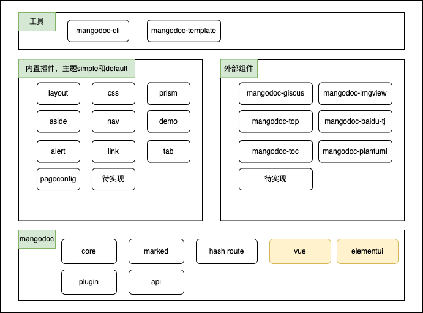
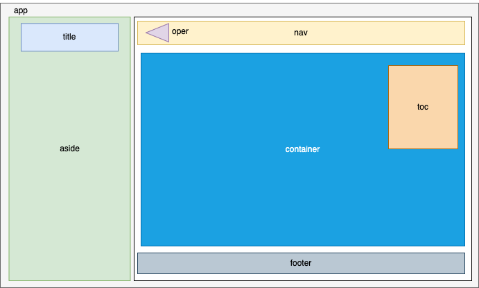
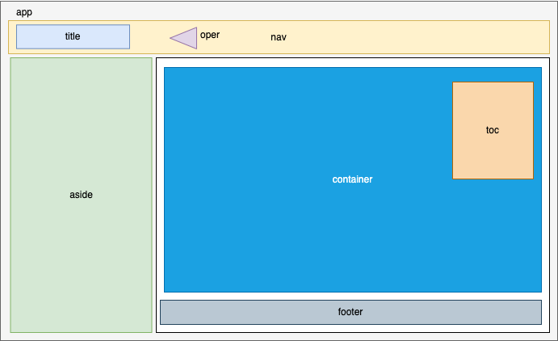

# mangodoc
一个简单的doc文档构建器，采用微内核架构风格实现，使用插件机制来支持扩展。

参考[docsify](https://docsify.js.org/#/zh-cn/)和[chatGPT](https://chat.openai.com/chat)。

[在线demo](https://mangodoc.meiflower.top)

## 架构图

## 布局说明
### default的主题布局

类似后台管理布局，严谨规整。

### simple的主题布局

去掉大部分border，更加简约，不受条条框框限制。

## 特性
* 简单文档：基于`javascript`(1.x)或者`typescript`(2.x)实现的简单文档生成器。
* 脚手架工具：支持[mangodoc](https://github.com/mg0324/mangodoc-cli)工具快速创建文档模板并启动。
* `marked`转换:基于`marked`实现`markdown`到`html`的转换。
* `elementui`风格：基于[elementui](https://element.eleme.cn/#/zh-CN/component/installation)的vue组件版本构建。
* 简单路由：基于`es6`中的`fetch()`加上`window.location.hash`实现路由。
* 静态部署：支持静态资源部署，如`gitee pages`、`github pages`、`docker`和`paas http server`等。
* 插件扩展：提供插件API接口，包括生命周期和部分事件监听函数。
* 支持vue：md内支持局部使用，详情参考[例子](#/demo/elementui)。
* 接口api: 将内部配置暴露为`window.$mangodocApi`提供给外部插件调用。
* 内置主题: 支持2款内置主题，分别是`default`和`simple`。

## 插件列表
* 内置插件core - 支持文档布局、文档核心、hash路由、加载提示、接口api及插件机制
* 内置插件css - 支持内置样式嵌入
* 内置插件aside - 支持左侧目录栏配置和生成
* 内置插件nav - 支持顶部导航条配置和生成
* 内置插件prism - 基于`prismjs`支持代码高亮
* 内置插件pageconfig - 支持页面配置
* 内置插件alert - 支持alert告警格式文本
* 内置插件link - 支持link链接格式文本
* 内置插件tab - 支持tab标签格式文本
* 外部插件[mangodoc-giscus](https://github.com/mg0324/mangodoc-giscus) - 支持giscus评论
* 外部插件[mangodoc-toc](https://github.com/mg0324/mangodoc-toc) - 支持文章目录书签生成
* 外部插件[mangodoc-imgview](https://github.com/mg0324/mangodoc-imgview) - 集成`hammerjs`支持图片点击查看和放大移动
* 外部插件[mangodoc-top](https://github.com/mg0324/mangodoc-top) - 支持文章阅读时返回顶部
* 外部插件[mangodoc-baidu-tj](https://github.com/mg0324/mangodoc-baidu-tj) - 支持集成百度统计
* 外部插件[mangodoc-plantuml](https://github.com/mg0324/mangodoc-plantuml) - 支持集成`plantuml`
* 外部插件[mangodoc-valine](https://github.com/mg0324/mangodoc-valine) - 支持valine评论，匿名评论
* 外部插件[mangodoc-busuanzi](https://github.com/mg0324/mangodoc-busuanzi) - 集成卜算子，显示网站访问信息
* 外部插件[mangodoc-update-time](https://github.com/mg0324/mangodoc-update-time) - 显示文档最后修改时间

