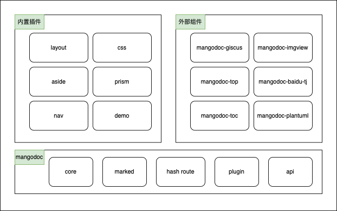

# mangodoc
一个简单的doc文档构建器，采用微内核架构风格实现，使用插件机制来支持扩展。参考[docsify](https://docsify.js.org/#/zh-cn/)和[chatGPT](https://chat.openai.com/chat)。

[在线demo](https://mangodoc.meiflower.top)

## 架构图



## 特性
* 简单文档：基于`javascript`实现的简单文档生成器。
* `marked`转换:基于`marked`实现`markdown`到`html`的转换。
* `elementui`风格：基于[elementui](https://element.eleme.cn/#/zh-CN/component/installation)的vue组件版本构建。
* 简单路由：基于`es6`中的`fetch()`加上`window.location.hash`实现路由。
* 静态部署：支持静态资源部署，如`gitee pages`、`github pages`等。
* 插件扩展：提供插件API接口，包括生命周期和部分事件监听函数。
* 支持vue：md内支持局部使用，详情参考[例子](#/demo/elementui)。
* 接口api: 将内部配置暴露为`window.$mangodocApi`提供给外部插件调用。
* **内置三款主题**：`default`（默认）、`simple`（简洁）、`cool`（酷炫）。

## 主题切换
```javascript
window.$mangodoc = {
    theme: "cool", // "default" | "simple" | "cool"
};
```

## 插件列表
* 内置插件core - 支持文档布局、文档核心、hash路由、加载提示、接口api及插件机制
* 内置插件css - 支持内置样式嵌入
* 内置插件aside - 支持左侧目录栏配置和生成
* 内置插件nav - 支持顶部导航条配置和生成
* 内置插件prism - 基于`prismjs`支持代码高亮
* 内置插件fullscreen - 支持文档全屏显示，包含全屏按钮、布局优化和toc位置调整
* 内置插件iconfont - 支持iconfont字体图标，内置常用图标并支持自定义iconfont资源
* 内置插件wordcount - 显示文档内容字数及大约阅读时间（simple/cool 主题）
* 内置插件darkmode - 深色/浅色模式切换（cool 主题）
* 内置插件particles - 动态粒子连接背景（cool 主题，默认关闭）
* 内置插件imgview - 图片灯箱，点击图片放大查看，支持滚轮缩放、拖拽平移、双击还原
* 外部插件[mangodoc-giscus](https://github.com/mg0324/mangodoc-giscus) - 支持giscus评论
* 外部插件[mangodoc-toc](https://github.com/mg0324/mangodoc-toc) - 支持文章目录书签生成
* 外部插件[mangodoc-top](https://github.com/mg0324/mangodoc-top) - 支持文章阅读时返回顶部
* 外部插件[mangodoc-baidu-tj](https://github.com/mg0324/mangodoc-baidu-tj) - 支持集成百度统计
* 外部插件[mangodoc-plantuml](https://github.com/mg0324/mangodoc-plantuml) - 支持集成`plantuml`
* 外部插件[mangodoc-valine](https://github.com/mg0324/mangodoc-valine) - 支持valine评论，匿名评论
* 外部插件[mangodoc-busuanzi](https://github.com/mg0324/mangodoc-busuanzi) - 集成卜算子，显示网站访问信息
* 外部插件[mangodoc-update-time](https://github.com/mg0324/mangodoc-update-time) - 显示文档最后修改时间

## 使用 cool 主题

在页面初始化配置中设置 `theme: "cool"` 即可启用。

### cool 主题特性
* **深色模式**：内置深色/浅色模式切换按钮，支持跟随系统偏好，默认深色。
* **玻璃态设计**：导航栏、侧边栏、内容卡片采用毛玻璃效果（`backdrop-filter: blur`）。
* **渐变质感**：标题使用渐变色填充，按钮和焦点元素有渐变高亮。
* **粒子背景**：可选动态粒子连接动画（默认关闭，`particles: true` 启用）。
* **平滑动画**：hover 状态、页面切换、模式切换均有缓动动画。
* **暗色代码块**：暗黑主题代码高亮配色，浅色模式下代码块保持深色。
* **全屏阅读**：全屏模式适配玻璃态风格。
* **字数统计**：显示文档字数及阅读时间估算。

### cool 主题配置项
```javascript
window.$mangodoc = {
    theme: "cool",              // 启用 cool 主题
    themeColor: "#667eea",      // 主题色，默认 #409EFF
    darkMode: true,             // true=深色, false=浅色, 不设置=跟随系统偏好
    particles: false,           // 关闭粒子背景（默认 true，开启）
    particlesCount: 50,         // 粒子数量（默认 50）
    particlesSpeed: 0.4,        // 粒子移动速度（默认 0.4）
};
```

### cool 主题插件列表
* `css` - 酷炫样式：渐变色、毛玻璃、暗色主题整体配色
* `layout` / `aside` / `nav` - 布局、侧边栏、导航栏
* `darkmode` - 深色/浅色模式切换（含 localStorage 持久化 + 系统偏好检测）
* `particles` - 动态粒子连接背景（canvas 绘制，标签页隐藏时自动暂停）
* `fullscreen` - 增强版全屏阅读
* `wordcount` - 字数统计 + 阅读时间估算
* 共享插件：`prism` / `pageconfig` / `alert` / `link` / `tab` / `iconfont` / `imgview`

## cool 主题界面预览
- 深色太空背景，配合主题色渐变
- 导航栏和侧边栏带有毛玻璃效果和`backdrop-filter`
- 内容卡片半透明磨砂质感，hover 时发光边框
- 页面间切换配合 `themeColor` 主色调
- 代码块深色主题配色，语言标签高亮
- 响应式适配移动端

## 待办列表
- [x] （优化）优化`nav`上的更新日志链接，加上图标。
- [x] （优化）优化`nav`上的仓库链接，加上图标。
- [x] （优化）优化aside的激活颜色为主题色。
- [x] （优化）优化aside的标题logo在小屏下显示的尺寸。
- [x] （修复）修复`mangodoc-update-time`最后修改时间显示为`Invalid Date`的bug。
- [x] （修复）修复刷新文档内链接后，title显示为默认标题的bug。
- [x] （修复）修复aside的宽度初次显示不一致的问题，有时候宽有时候窄。
- [x] （优化）在footer内增加备案信息显示。
- [x] (future) 支持文章全屏阅读，能收展头部和左侧等内容。
- [x] （新特性）支持iconfont字体图标。
- [x] （新插件）显示文档内容字数及大约阅读时间。
- [x] （新特性）设计并支持第三款酷炫主题（cool theme）。
- [x] （新插件）在文档末尾显示附近范围内的分页内容。
- [x] （新特性）设计并支持文档封面页。
- [ ] （新插件）基于markmap支持思维导图，支持超链接跳转。
- [x] （完善）支持内置更多的颜色标签，比如green/red/blue/yellow/orange/purple/pink/brown/gray/black/white等。
- [x] （完善）md中code代码块的样式优化，目前显示不明显。

## 未来特性
建议新增的特性/插件（按优先级）
### 高优先级

* [x] 全文搜索 — 最核心缺失功能。使用 minisearch/flexsearch 构建客户端索引，在导航栏添加搜索框
* [x] 上/下页导航 — README 已有 TODO，基于侧栏顺序在文档底部显示上一页/下一页                            
* [x] 编辑此页链接 — 低工作量高回报，根据 repo 配置 + 当前路径生成 GitHub 编辑链接                            
* [x] 封面页完善 — README 已有 TODO，现有骨架需打磨 UI 和配置                                                
                                                                                                        
### 中优先级                                                                                                  
                                                                                                        
* Mermaid 图表插件 — 补充 PlantUML， ``mermaid ` 代码块渲染流程图/时序图等                               
* [x] 代码复制按钮 — 每个 <pre> 代码块右上角加复制按钮                                                        
* 目录高亮追踪 — 滚动时高亮侧栏中当前章节                                                                
* Markmap 思维导图 — README 已有 TODO                                                                     
                                                                                                        
### 低优先级                                                                                                  
                                                                                                        
* Markdown 容器 — ::: tip/warning/danger 语法支持                                                       
* 国际化 i18n — 多语言文档目录切换
* SEO 元信息 — 动态设置 description/OG 标签
* 打印/PDF导出 — @media print 样式 + 打印按钮
* [x] 图片灯箱 — 内置图片点击放大（替代外部插件）
* 版本切换 — 多版本文档支持

## 发布版本
1. 先安装依赖：`yarn`
2. 修改版本号
3. 打包：`yarn build`
4. 登陆npm：`npm login`
5. 发布：`npm publish`