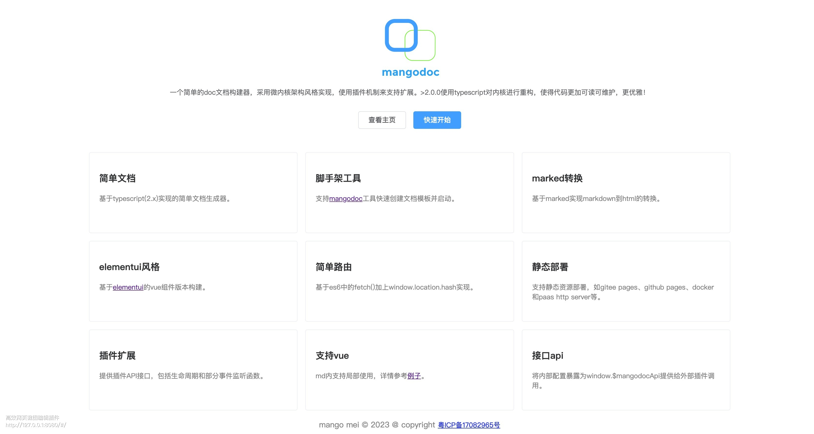

## 封面
### 1. 开启封面
在`index.html`中设置`coverPage`为`true`。
``` js
window.$mangodoc = {
    coverPage: true
}
```
### 2. 建立封面页
在`docs`文件夹下建立`coverpage.md`

> 注意如下内容其实是基于`mangodoc`对本地页内的vue支持实现的，可定义页内`style`和`vue config`，来使用`vue-elementui`构建自己的封面页。

详细内容请参考[封面页示例](https://raw.githubusercontent.com/mg0324/mangodoc/master/docs/coverpage.md)，（**可以自行调整，仅供参考**）

### 3. 预览


